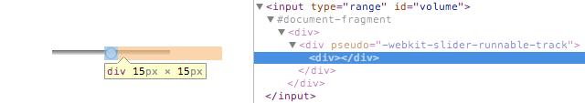
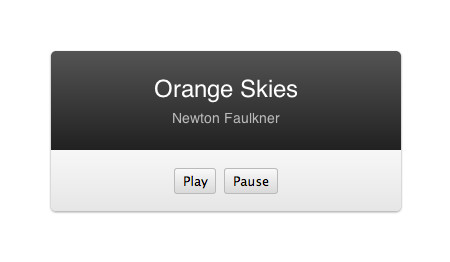

_перевод статьи [Working with Shadow DOM](http://blog.teamtreehouse.com/working-with-shadow-dom)_

Как разработчикам, нам необходимо часто создавать виджеты для интерфейсов, которые помогают нам проще совершать определённые задачи. Это могут быть слайдеры для контроля за воспроизведением видео, календари для выбора даты и многое другое. Проблема с которой мы сталкиваемся, создавая эти виджеты — управление _инкапсуляцией_.

Виджеты, которые мы пишем, часто используются на других страницах, но как мы можем быть уверены, что код на странице не будет пересекаться с кодом, использованным для самого виджета? Проблема создания границы между кодом _вашего_ виджета и кодом, который будет _использовать_ ваш виджет - похожа на проблему, которую решают [Web Components](http://www.webcomponentsshift.com/).

> Традиционный путь решения проблемы инкапсуляции - использование фреймов. Однака это далеко не идеальное решение и может часто вызывать проблемы.

В этом посте мы посмотрим на Shadow DOM, один из четырёх ключевых блоков, составляющих Web Components.

## Короткое введение в Shadow DOM

Shadow DOM позволяет браузерам добавлять поддеревья DOM элементов в уже отрендеренный и показанный на экране документ. Это не оказывает никакого эффекта на DOM дерево в вашем главном документе, браузер управляет Shadow DOM на лету, в то время когда он рендерит страницу. Непонятно? Давайте я объясню на примере.

Авторы браузеров уже используют Shadow DOM некоторое время для создания интерфейсных виджетов, таких как range inputs и datepickers, которые появились в HTML5. Эти виджеты на самом деле сделаны с использованием HTML и CSS. Вы не видите отдельные элементы, которые составляют этот виджет в панели разработчика, потому что они используют Shadow DOM, но они там есть.

Если вы включите поддержку Shadow DOM в настройках панели разработчика в Chrome вы сможете копнуть поглубже и увидеть элементы, составляющие эти виджеты. Чтобы включить эту поддержку выполните три следующих шага:

1. Откройте панель разработчика Chrome.
2. Откройте панель настроек кликнув на шестерёнку в правом нижнем углу.
3. Во вкладке «Общее» ‘General’ поставьте галочку «Показывать Shadow DOM».

Теперь если вы проинспектируете виджет, такой как range input, вы сможете изучить Shadow DOM, кликнув по маленькой серой стрелочке слева от элемента. Всё, что находится ниже, как раз и составляет range input в Chrome.

<figure>
    
    <figcaption>Просмотр Shadow DOM для range input</figcaption>
</figure>

> **Поддержка браузерами**: Shadow DOM на данный момент поддерживается в Chrome и Opera 15 (а также браузером от Яндекса - прим. переводчика)<br/>
> [Can I use… Shadow DOM](http://caniuse.com/#feat=shadowdom)

## Как работает Shadow DOM

Shadow DOM представляет новый тип ноды, который может быть ассоциирован с элементами — он называется shadow root. Элемент, имеющий связанный с ним shadow root, называется shadow host. Когда элемент является shadow host'ом, содержимое shadow root'а рендерится вместо контента host элемента. Давайте посмотрим на простой пример.

```javascript
<div>Hello, World!</div>
<script>
  var host = document.querySelector(‘div’);
  var root = host.webkitCreateShadowRoot();
  root.textContent = ‘Hello, Treehouse!’;
</script>
```

Здесь мы сначала создаём блок `<div>`, который станет нашим shadow host'ом. Затем мы используем JavaScript для создания shadow root'а на нашем host элементе с использованием метода `webkitCreateShadowRoot`. И наконец мы изменяем `textContent` shadow root'а на «Hello, Treehouse!».

> На самом деле вам не стоит класть важный контент страницы в Shadow DOM, так как он будет не доступен для поисковиков и экранных дикторов. Однако, в целях нашего простого примера мы сделаем исключение.

Картинка ниже показывает как то, что мы сделали, рендерится браузером. Заметьте, что изначальная текстовая нода «Hello, World!» всё ещё там, но не выводится на экране.

<figure>
    
    <figcaption>Просмотр Shadow DOM</figcaption>
</figure>

Теперь, когда вы изучили основы работы Shadow DOM. давайте посмотрим на более сложный пример.

## Создание реиспользуемых виджетов с использованием Shadow DOM

В этой части вы узнаете, как сделать простой музыкальный плеер, использующий Shadow DOM и HTML шаблоны. Виджет, который вы сделаете, можно увидеть ниже.

<figure>
    
</figure>

> Для того, чтобы оставить этот пример относительно простым, мы не будем беспокоиться о том, чтобы наш виджет на самом деле играл музыку. Мы всего лишь сфокусируемся на той части, которая касается Shadow DOM.

Используя Shadow DOM мы собираемся отделить внешнюю часть виджета (контролы управления и стилизацию) от содержимого виджета (название песни и имя артиста). Практика разделения содержимого и внешней части - это ключ к построению реиспользуемых виджетов.

### СОЗДАНИЕ ШАБЛОНА

Для начала мы создадим HTML шаблон для нашего виджета. Он будет отвечать за контролы управления и общий стиль плеера.

```html
<template id="musicPlayerTemplate">
  <style>
    .outer {
      width: 350px;
      font-family: Helvetica, Arial, sans-serif;
      -webkit-font-smoothing: antialiased;
      border-radius: 5px;
      overflow: hidden;
      box-shadow: 0 1px 3px rgba(0,0,0,0.4);
    }

    .info {
      background: #545454;
      background: -webkit-gradient(linear, left top, left bottom, color-stop(0%,#545454), color-stop(100%,#212121));
      background: -webkit-linear-gradient(top,  #545454 0%,#212121 100%);
      background: linear-gradient(to bottom,  #545454 0%,#212121 100%);
      padding: 1.5em;
      text-align: center;
    }

    .song {
      color: #FFFFFF;
      font-size: 1.5em;
    }

    .artist {
      margin-top: 0.5em;
      color: #BABABA;
      font-size: 0.9em;
    }

    .controls {
      padding: 1em;
      text-align: center;
      background: #f7f7f7;
      background: -webkit-gradient(linear, left top, left bottom, color-stop(0%,#f7f7f7), color-stop(100%,#e6e6e6));
      background: -webkit-linear-gradient(top,  #f7f7f7 0%,#e6e6e6 100%);
      background: linear-gradient(to bottom,  #f7f7f7 0%,#e6e6e6 100%);
    }

    button {
      background: #f9f9f9;
      background: -webkit-gradient(linear, left top, left bottom, color-stop(0%,#f9f9f9), color-stop(100%,#d9d9d9));
      background: -webkit-linear-gradient(top,  #f9f9f9 0%,#d9d9d9 100%);
      background: linear-gradient(to bottom,  #f9f9f9 0%,#d9d9d9 100%);
      border: 1px solid #BABABA;
      border-radius: 3px;
      font-size: 0.8em;
      padding: 0.3em 0.6em;
      cursor: pointer;
    }
  </style>

  <div class="outer">
    <div class="info">
      <div class="song">
        <content select=".song"></content>
      </div>
      <div class="artist">
        <content select=".artist"></content>
      </div>
    </div>
    <div class="controls">
      <button class="play">Play</button>
      <button class="pause">Pause</button>
    </div>
  </div>
</template>
```

Теперь, когда у нас есть код для внешнего представления, нам надо написать код, который будет отвечать за функционал нашего виджета.

### ПРОЕЦИРОВАНИЕ СОДЕРЖИМОГО

Чтобы наш виджет заработал, в первую очерень нам надо создать элемент, который станет нашим shadow host. Он должен содержать то, что нужно нашему виджету (название песни и имя артиста).

```html
<div id="musicPlayer">
  <span class="song">Orange Skies</span>
  <span class="artist">Newton Faulkner</span>
</div>
```

Заметьте, что мы дали двум `<span>`-элементам классы. Нашему виджету надо показывать песню, которая играет и имя артиста. С этой целью мы **проецируем** этот контент в нужное место, используя элемент `<content>`.

По умолчанию весь контент из shadow host'а будет проецироваться в шаблон в местоположение элемента `<content>`. Однако, у нас две отдельных части содержимого, которые нам надо показывать в разных местах внутри нашего виджета. К счастью у элемента `<content>` есть атрибут `select`, позволяющий нам указать из какого элемента shadow host'а наш контент будет спроецирован. Если вы посмотрите на код шаблона, вы заметите два элемента `<content>`, таких же, как в коде ниже.

```html
<div class="song">
  <content select=".song"></content>
</div>
<div class="artist">
  <content select=".artist"></content>
</div>
```

Здесь мы используем атрибут `select`, для того, чтобы точно указать класс элемента, откуда должен прийти наш контент.

Последняя вещь, которую нам надо сделать - написать немного JavaScript'а, который будет создавать новый shadow root и загружать шаблон HTML для нашего виджета.

```javascript
<script>
  var host = document.querySelector('#musicPlayer');
  var shadow = host.webkitCreateShadowRoot();
  var template = document.querySelector('#musicPlayerTemplate');
  shadow.appendChild(template.content);
  template.remove();
</script>
```

Здесь в начале мы создаём ссылку на shadow host (`<div>` с ID `musicPlaery`) и создаём новый shadow root, как мы сделали раньше. Затем мы получаем ссылку на шаблон, созданный нами для виджета. Наконец мы добавляем содержимое шаблона к shadow root и удаляем изначальный шаблон из DOM-модели документа. Так как мы использовали элементы `<content>`, браузер позаботится о правильном проецировании контента в нужные места нашего виджета.

Это всё, что вам надо знать, чтобы начать делать ваши собственные виджеты Shadow DOM!

## В заключение

Надеюсь, эта статья показала вам, как полезен может быть Shadow DOM, когда дело касается создания реиспользуемых виджетов для ваших интерфейсов.

Поддержка браузерами Shadow DOM на текущий момент ограничена Chrome'ом и Оперой 15 (и Яндекс.Браузером — прим. переводчика), что означает, что данная технология не готова к широкому использованию. Однако, я думаю, что у неё есть большой потенциал и она действительно может произвести революцию в создании сайтов.

## Полезные ссылки

* [W3C Shadow DOM Specification](http://www.w3.org/TR/shadow-dom/)
* [HTML5 Demos: Shadow DOM Visualizer](http://html5-demos.appspot.com/static/shadowdom-visualizer/index.html)
* [Shadow DOM 301: Advanced Concepts & DOM APIs](http://www.html5rocks.com/en/tutorials/webcomponents/shadowdom-301/)
