Некоторое время назад интернет заполонили картинки с [бесчисленным количеством глаз](https://yandex.ru/images/search?text=deep%20dream). Это было, возможно, не совсем ожидаемое разработчиками использование программы, которая всего-лишь пыталась найти известные предметы на новых изображениях. Практическая польза алгоритма понятна — поиск по картинкам, который использует не только метаданные и описание, а действительно пытается найти изображённые предметы. Поэтому, если он знает только о том, как выглядит глаз — он будет пытаться находить его в любых очертаниях.

[Программа](https://github.com/jcjohnson/neural-style), с которой я экспериментировал, берёт за основу другой [алгоритм](http://arxiv.org/abs/1508.06576), который также работает с изображениями, но он изучает стиль рисунка, характерные цвета, а потом пробует применить полученные знания для другого изображения. Практическию пользу извлечь из этого, как мне кажется, сложней (фильтры для инстаграмма?), но, в любом случае, исследования и практические наработки в области моделирования нейронных сетей понемногу приближают нас к созданию искусственного интеллекта.

Для запуска алгоритма я установил в своей системе Virtual Box и создал виртуальную машину с Ubuntu. Далее устанавливал все необходимые программы по [инструкции](https://github.com/jcjohnson/neural-style/blob/master/INSTALL.md). Здесь нет никаких сложностей, но я не делал большое количество опциональных шагов для установки CUDA, потому что у меня нет видеокарты от nvidia. Надо сказать, что, перенося вычисления на GPU, можно добиться ощутимого роста скорости выполнения алгоритма. Одну и ту же картинку на видеокарте можно получить за 4 минуты, а на CPU у меня это занимало 3 часа. Ещё один важный момент — количество оперативной памяти. Сначала я выделил виртуальной машине 1Гб памяти, и программа просто крашилась чуть ли не сразу. В итоге я остановился на 5Гб, что позволяло мне преобразовывать картинки с максимальным размером одной стороны до 500 пикселей.

После пары неудачных попыток использовать портрет в качестве исходного изображения, я остановился на фотографиях, где окружение и фон занимает больше места, чем человек. Для портретов не помогло даже использование других портретов в качестве стилевых изображений. Вот две последние и самые удачные попытки со всеми промежуточными итерациями.

    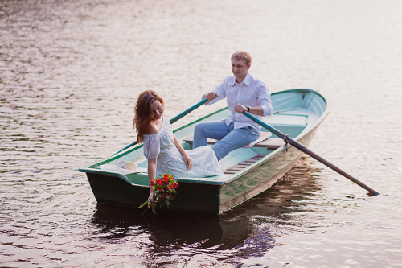
    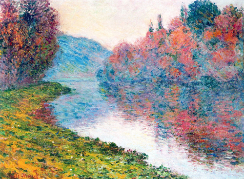
    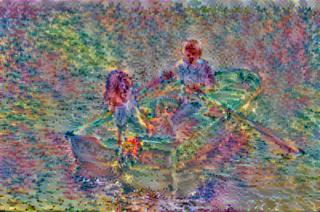
    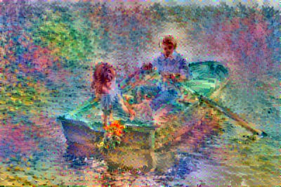
    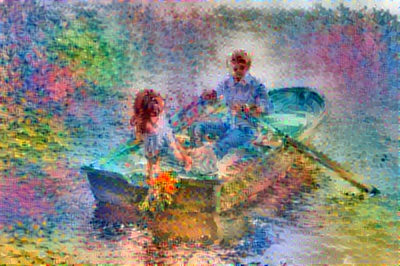
    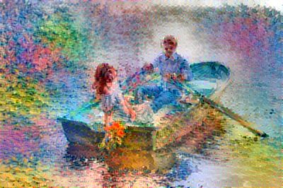
    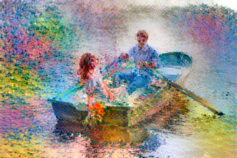
    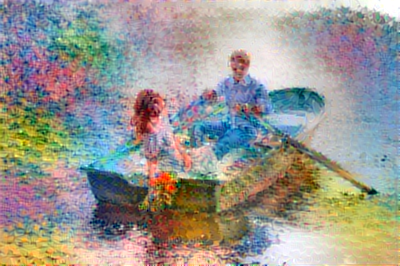
    
    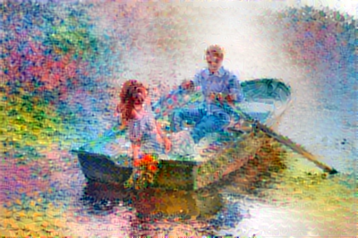
    
    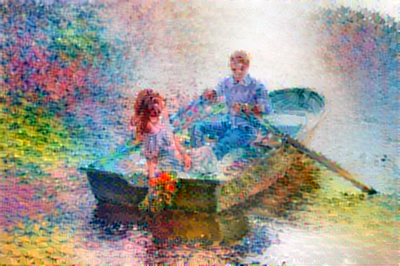

    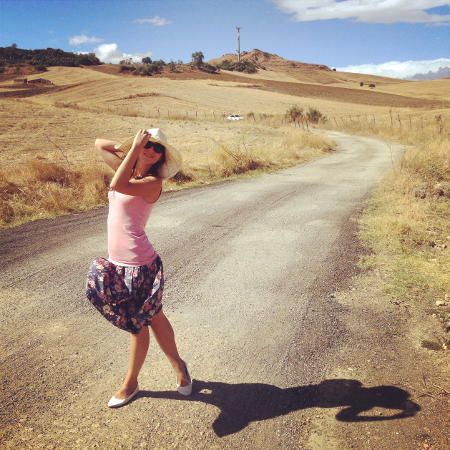
    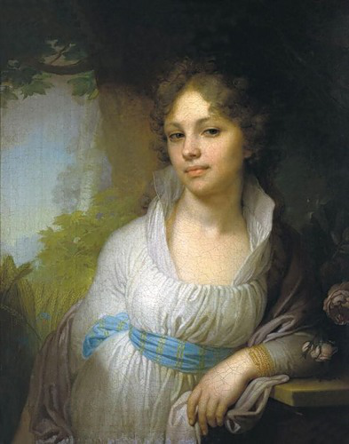
    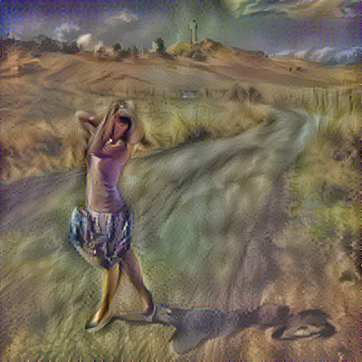
    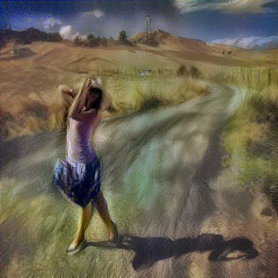
    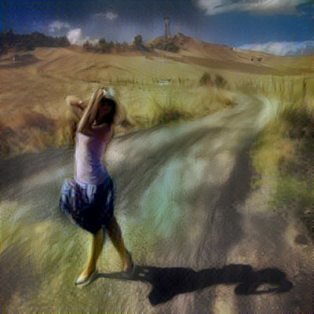
    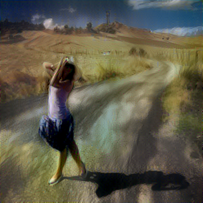
    
    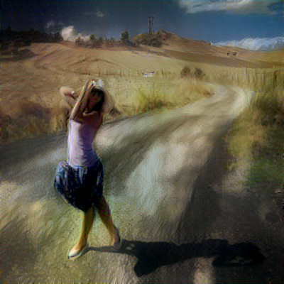
    
    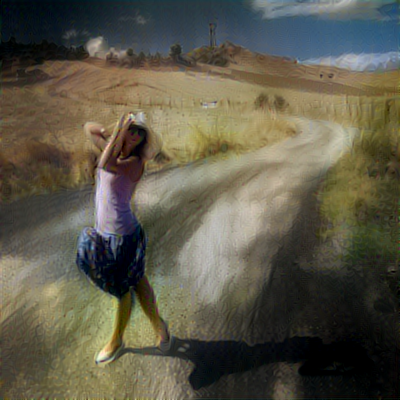
    
    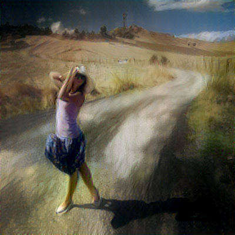

